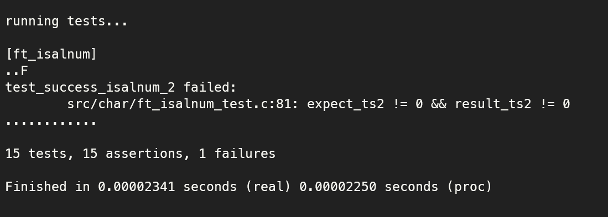

# libft
Very first project at 42 as Cadet.

"libft" contains a set of recoded C functions. The idea is to increase it overtime so that it can be used in future 42 projects.
 

## How to use
**Be advised, this project is customized. If you decided to use it as reference, good! But do not use it as a "deliverable project"**  

### Build and Clean Flows
* To build libft, run: `make [all]`.
* To keep the directory clean, run: `make clean`.
* At this point, the lib file "libft.a" will be available to be linked. To link it, you may use gcc, e.g.: `gcc -Wall -Wextra -Werror test.c -L. -l:libft.a -o test.out`; where:
	* "-L.", explicits tells the compiler the lib directory;
	* "-l:libft.", explicits tells the compiler the lib name;
	* see more option in: `man gcc`.
* It's possible to run `make clean`, `make fclean` or `make re` to clean unused objects, clean all build artifacts and redo the build from top, respectively.

### Unit Test Flow (WIP)
* Using "minunit" test framework: https://github.com/siu/minunit.
* Run: `make test && make clean && ./main_test.out`. The output will be similar to the following image.
	
* `[ft_isalnum]` : function's name that are being tested.
* `..F` : each "dot" is an assertion, each "F" is a failed test.
* `test_success_isalnum_2 failed (...)` : details of the failed test.
* `15 tests, 15 assertions (...)` : summary of the test.

### Project structure
TBD

## Before delivery
- [x] clean Makefile (wildcard, test, links, etc.)
- [x] test norm: local
- [x] test with libft_warmachine: local
- [x] test with libft_tripouille: local
- [x] test with libft_libft_unittest: local 
(no 'so' rule in Makefile final version)
- [x] git final: clean all files
- [x] git final: check on github
- [x] test norm: guaca
- [x] test with libft_warmachine: guaca
- [x] test with libft_tripouille: guaca
- [x] test with libft_libft_unittest: guaca

## After delivery (to-do)
- [x] rearrange directory tree
- [x] redo Makefile with more clean look'nfeel
- [ ] refactor unit tests to include c libs in the header file (libft_test.h)
- [ ] create more functions such as: ft_isspace, ft_issgnal, etc...
- [ ] create validation functions such as: limits.h (maybe into ../libft.h)
- [ ] refactor functions such as: ft_strrchr (can be done backwards instead), str{nstr, lcpy, lcat} (can be done w/o explicit pointer operations)
- [ ] refactor where is possible to use 'unsigned char' for casting when need to compare (const) char w/ int, for instace
- [ ] refactor oppurtunity: maybe it's possible to use ft_str{iteri, mapi} on Pt1 functions
- [ ] review all Part 2 when possible
- [ ] rafactor strncmp, revising the rest of: (n-- < 0)
- [ ] unit tests (using minunit.h):
  - [x] ft_isalnum
  - [x] ft_isalpha
  - [x] ft_isascii
  - [x] ft_isdigit
  - [x] ft_isprint
  - [x] ft_tolower
  - [x] ft_toupper
  - [ ] ft_atoi
  - [ ] ft_bzero
  - [ ] ft_calloc
  - [ ] ft_itoa
  - [ ] ft_memchr
  - [ ] ft_memcmp
  - [ ] ft_memcpy
  - [ ] ft_memmove
  - [ ] ft_memset
  - [ ] ft_puchar_fd
  - [ ] ft_putendl_fd
  - [ ] ft_putnbr_fd
  - [ ] ft_putstr_fd
  - [ ] ft_split
  - [ ] ft_strchr
  - [ ] ft_strdup
  - [ ] ft_striteri
  - [ ] ft_strjoin
  - [ ] ft_strlcat
  - [ ] ft_strlcpy
  - [ ] ft_strlen
  - [ ] ft_strmapi
  - [ ] ft_strncmp
  - [ ] ft_strnstr
  - [ ] ft_strrchr
  - [ ] ft_strtrim
  - [ ] ft_substr
- [ ] valrind tests (to be defined how...)
---
 

# Part 1 - Libc functions (23 out 23)

## char functions (7 out 7)
- [x] int		ft_isascii(int c)
- [x] int		ft_isprint(int c)
- [x] int		ft_isalpha(int c)
- [x] int		ft_isdigit(int c)
- [x] int		ft_isalnum(int c)
- [x] int		ft_toupper(int c)
- [x] int		ft_tolower(int c)

### Premisses adopted for "char functions":
- re-use 'ft_'* functions as much as possible (e.g.: ft_isalnum);
- all functions uses ascii char set, meaning that all functions has 'ft_isacii' as check premisse;
- when were possible, the explicit 'char' was used on comparisons (e.g.: ft_is{alpha, digit});
---

## str functions (9 out 9)
- [x] int		ft_atoi(const char *nptr)
- [x] size_t	ft_strlen(const char *s)
- [x] int		ft_strncmp(const char *s1, const char *s2, size_t n)
- [x] char		\*ft_strchr(const char \*s, int c)
- [x] char		\*ft_strrchr(const char \*s, int c)
- [x] char		*ft_strnstr(const char *big, const char *little, size_t len)
- [x] size_t	ft_strlcpy(char *dst, const char *src, size_t dstsize)
- [x] size_t	ft_strlcat(char *dst, const char *src, size_t dstsize)
- [x] char		*ft_strdup(const char *s) [malloc]

### Premisses adopted for "str functions":
- re-use 'ft_'* functions as much as possible (e.g.: ft_atoi, ft_str{chr, rchr, lcpy, lcat, dup})
- some functions were casted using 'unsigned char' type, so that we can garantee the proper behavior (e.g.: ft_str{chr, rchr}
- when were possible, the explicit 'char' were used on comparisons (e.g.: ft_atoi, ft_str{chr, rchr})
- when were possible, the implicit pointer operations were used (e.g.: ft_atoi, ft_str{len, ncmp, chr, rchr})
- when were possible, no aux variables were created to "roam" poiters (e.g.: ft_strncmp[n--], ft_strl{cpy, lcat}[dstsize--])
- on ft_strnstr, were used iterators to explicit operates the pointers and on comparisons, in the future would be nice to refactor it
- on ft_strlcpy and ft_strlcat, were used an iterator to explicit operates the pointers, in the future would be nice to refactor it
---

## mem functions (6 out 6)
- [x] void		ft_bzero(void *s, size_t n)
- [x] void		*ft_memset(void *s, int c, size_t n)
- [x] void		*ft_memcpy(void *dest, const void *src, size_t n)
- [x] void		*ft_memmove(void *dest, const void *src, size_t n)
- [x] int		ft_memcmp(const void *s1, const void *s2, size_t n)
- [x] void		*ft_memchr(const void *s, int c, size_t n)
- [x] void		*ft_calloc(size_t nmemb, size_t size) [malloc]

### Premisses adopted for "mem functions":
- re-use 'ft_'* functions as much as possible (e.g.: ft_bzero, calloc)
- some functions were casted using 'unsigned char' type, so that we can garantee the proper behavior (e.g.: ft_mem{cmp, chr}
- when were possible, no aux variables were created to "roam" poiters (e.g.: ft_mem{set, cpy}[n--])
- as those functions operates memory directly, all operations were made using 'int' type
- to cast the void pointers, were user 'unsigned char *' type, so that we can garantee the 1 byte size (based on manual)
- on ft_memmove, were used an iterator to explicit operates the pointers, in the future would be nice to refactor it; also as malloc is prohibited here, the strategy were to reverse copy the bytes if the address from 'dest' were greater tham 'src' to garantee the copy even with memory overlap
---
 

# Part 2 - Additional functions (11 out 11)

## fd functions (4 out 4)
- [x] void 	ft_putchar_fd(char c, int fd) [write]
- [x] void	ft_putstr_fd(char *s, int fd) [write]
- [x] void	ft_putendl_fd(char *s, int fd) [write]
- [x] void	ft_putnbr_fd(int n, int fd) [write]

### Premisses adopted for "fd functions":
- re-use 'ft_'* functions as much as possible (e.g.: ft_put{str, endl, putnbr}_fd)
---

## str functions (5 out 5)
- [x] char	*ft_substr(char const *s, unsigned int start, size_t len) [malloc]
- [x] char	*ft_strtrim(char const *s1, char const *set) [malloc]
- [x] char	*ft_itoa(int n) [malloc]
- [x] char	*ft_strjoin(char const *s1, char const *s2) [malloc]
- [x] char	\*\*ft_split(char const *s, char c) [malloc] [free]

Premisses adopted for "str functions":
- re-use 'ft_'* functions as much as possible (e.g.: ft_substr, str{trim, join, itoa})
---

## iter, map functions (2 out 2)
- [x] char	*ft_strmapi(char const \*s, char (\*f)(unsigned int, char)) [malloc]
- [x] void	ft_striteri(char \*s, void (\*f)(unsigned int, char*))
---
 
